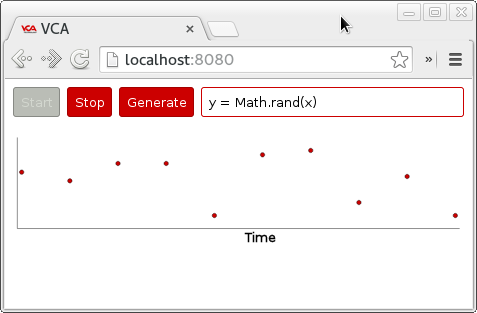

# Web Components

This is a test that assesses web component application development skills.

## Goals

 * Build a web application that can graph the continuous output of JavaScript
generator functions



## Getting Started

If you know how to use `git` then just clone this repository, otherwise you can
download the source code as a compressed archive using the 'Download' dropdown
above. If using `git` provide a clear commit history put the repository up
somewhere public (GitHub, Bitbucket, etc) so we can access it. The other option
is to submit the code as a compressed archive (`.tar.xz`, `.zip`, etc) for
assessment.

The web components test uses [bower](http://bower.io/) to manage the web
component dependencies needed for the project. Install that on to your system
then run the following command to get going:

```
$ # Install the bower components defined in bower.json
$ bower install
```

This will install the components under the directory `bower_components`.
 `bower` hasnow installed all the necessary components needed to run the web
application. To view the web application a web server needs to be running
 locally tocorrectly load the web components. There is a `node` web server
 script alreadywritten in `server.js` so to start the web server run:

```
$ # Install the necessary node modules defined in package.json
$ npm install
$ # Run the web server
$ node server.js
```

Direct a browser at [http://localhost:8080](http://localhost:8080) to see the
web application in action!

## Suggestions

Have a look through the currently created web components to understand how they
work. They are heavily commented and provide more implementation ideas. The
currently created components are:

 * [test-app](components/test-app/test-app.html)
 * [test-graph](components/test-graph/test-graph.html)
 * [test-generator](components/test-generator/test-generator.html)

Try to store all of your progress in the `git` history to provide an easy way to
show your development work at the end of the test. Keeping branches of
different stages of your development might be useful to show at the end of the
test, even if they weren't used in the finished application.

Creating new components will be ignored by default due to the `.gitignore`
rules to ignore installed `bower` components. Add new components to the
`.gitignore` list so that they can be tracked by `git`.

Web components are specifically designed to be re-useable. There are
repositories of web components out there that can be used as bower
dependencies. Feel free to use components if they will accelerate your
development.

## Stretch Goals

If all implementation suggestions are completed then the following stretch
goals can be attempted:

 * Build system (grunt, ...)
 * Static code analysis (JSLint, ...)
 * Component API documentation (YUIDoc, ...)
 * Unit testing (web-component-tester, ...)

Otherwise, take the application to the limit of your abilities and show off!

